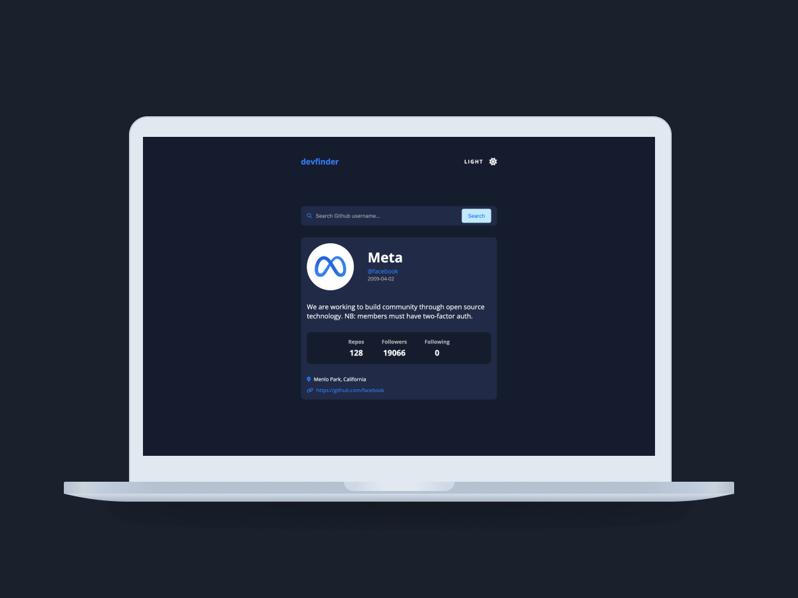

# About Me

## I'm a passionate software engineer specializing in web development with experience in HTML, CSS, Tailwind, SASS, JavaScript, React, Astro, Node, Express, MySQL, and Git. I focus on creating intuitive and efficient interfaces, leveraging strong time management, leadership skills, and a natural ability to solve problems. Always eager to learn new technologies and enhance my skills.

# Technical Skills

# Learning

# Relevant Projects

<table>
    <tr>
      <td align="center" width="300" height="200">
        
         
        <strong>Soma</strong>
         
        
Web platform designed to provide users with essential health tools.

      </td>
      <td align="center" width="300" height="200">
        
         
        <strong>Readify</strong>
         
        
eBook e-commerce esigned to make reading accessible and enjoyable for everyone.

      </td>
      <td align="center" width="300" height="200">
        
         
        <strong>Note Taker</strong>
         
        
Web application that allows users write, save, edit and delete notes.

      </td>
    </tr>
    <tr>
          <td align="center" width="300" height="200">
        
         
        <strong>Password Generator</strong>
         
        
Web application that allows user generate secure passwords.

      </td>
      <td align="center" width="300" height="200">
        
         
        <strong>MovieSpot</strong>
         
        
Web application that allows users to search for movies.

      </td>
      <td align="center" width="300" height="200">
        
         
        <strong>Advice</strong>
         
        
Web application that allows users to generate random advices

      </td>
    </tr>
        <tr>
          <td align="center" width="300" height="200">
        
         
        <strong>Eventor</strong>
         
        
Web application to search events by state and category.

      </td>
      <td align="center" width="300" height="200">
        
         
        <strong>Github User Search</strong>
         
        
Web application to search Github profile information.

      </td>
      <td align="center" width="300" height="200">
        
         
        <strong>Andrea Portfolio</strong>
         
        
Portfolio landing page with a modern and reusable design.

      </td>
    </tr>
</table>
  

### Support or Contact

For support or if you wish to contact me, feel free to email me at [johanherrera20000@gmail.com](mailto:johanherrera20000@gmail.com).

You can also reach out to me via [LinkedIn](https://www.linkedin.com/in/johanh0/).
